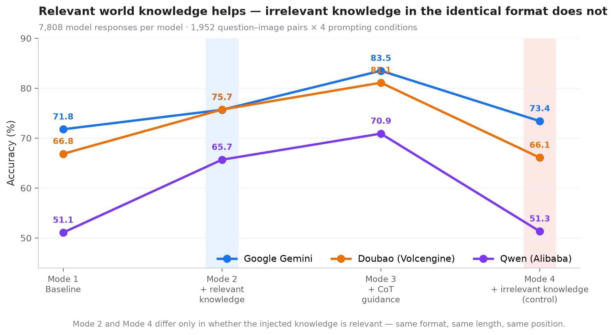
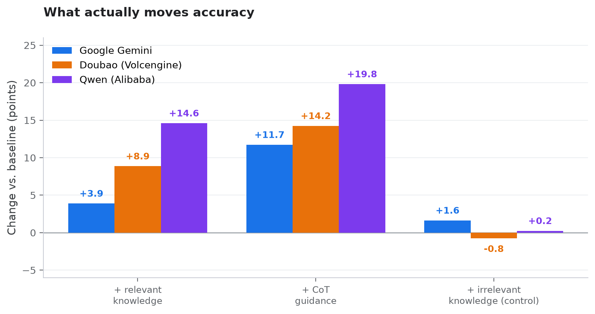

# Can VLMs Actually Reason with World Knowledge?

**A counterfactual image-understanding benchmark for Vision-Language Models**

> **In short:** We build 558 counterfactual questions over 329 images across four
> subjects, and evaluate three production VLMs under four prompting conditions
> (**7,808 model responses per model**). The headline result: giving a model the
> *relevant* piece of world knowledge boosts accuracy by up to **+14.6 points**,
> while giving it an *irrelevant* piece of world knowledge in the identical
> format barely moves the needle (**−0.8 to +1.6**) — evidence that these gains
> come from the knowledge itself, not from generic few-shot priming.

---

## Why this exists

Standard VQA benchmarks mostly test whether a model can *name what's in the
picture*. That is recognition, not understanding.

Real understanding means you can take a familiar situation and reason about it
under **counterfactual perturbation** — change one variable and predict what
happens. That is what this benchmark does:

| Subject | Image | Everyday situation | Counterfactual probe |
|---|---|---|---|
| 生物 · 酶的活性 | 菠萝泡盐水 | 盐水能减少菠萝扎嘴 | 换成**酒精**还能减少刺激吗？换成**清水**呢？ |
| 化学 · 钝化 | 金属钝化处理 | 浓硝酸使金属钝化 | 换成**浓硫酸**会怎样？换成**铝制**物品呢？ |
| 物理 · 力学支撑 | 积木塔 | 积木塔稳定 | 抽出**中间一层的一块**会怎样？ |
| 安全常识 · 红绿灯 | 路口 | 红灯禁止通行 | 此时**向右行驶**可以吗？ |

Each unit starts from an everyday situation any human with basic life experience
can reason about — then perturbs it. A model that pattern-matches falls for the
distractors; a model that understands does not.

---

## Dataset

**95 units · 329 images · 558 questions** across four subjects.

| Subject | Units | Images | Questions |
|---|---|---|---|
| Physics (物理) | 38 | 131 | 226 |
| Biology (生物) | 28 | 97 | 166 |
| Chemistry (化学) | 19 | 67 | 114 |
| Safety common sense (安全常识) | 10 | 34 | 52 |
| **Total** | **95** | **329** | **558** |

**Question types** — deliberately balanced:

| Type | Count | Scoring |
|---|---|---|
| 简答题 (open-ended) | 184 | LLM-as-judge against a rubric + `core` knowledge point |
| 选择题 (multiple choice) | 187 | Exact letter-set match (multi-select aware) |
| 判断题 (true/false) | 188 | Parsed boolean comparison |

Each unit contains:

- `files` — 2–4 images of the same scenario
- `pre_question` / `pre_answer` — a **world-knowledge probe requiring no image**
  (e.g. *如何让菠萝吃起来不那么扎嘴？*). This is later injected as context to test
  whether the model *has* the relevant knowledge.
- `questions` — counterfactual variants grounded in the images
- `core` — the knowledge point being tested (used by the judge)
- `COT` — a human-written reasoning scaffold, used in the CoT condition

---

## Method: four prompting conditions

The core design is a **2×2 that isolates knowledge from format**. Every question
is asked under four conditions; the fourth is the control that makes the second
interpretable.

| Mode | Name | What is added |
|---|---|---|
| **1** | Baseline | Image + question only |
| **2** | In-subject priming | Same unit's `pre_question` + `pre_answer` as few-shot context |
| **3** | CoT guidance | Unit's `COT` scaffold injected into the system prompt |
| **4** | **Cross-subject control** | A **random unit from a different subject**'s `pre_question` + `pre_answer` |

> **Mode 4 is the point of the design.** It has the identical *format* to mode 2
> (same few-shot shape, same length, same position) but carries *irrelevant*
> knowledge. Any gap between mode 2 and mode 4 is therefore attributable to the
> knowledge being relevant — not to few-shot priming in general.

---

## Models evaluated

| Model | Identifier | Provider |
|---|---|---|
| Google Gemini | `gemini-3.1-pro` | GRSAI (OpenAI-compatible) |
| 火山引擎 Doubao | `doubao-seed-2-0-lite-260215` | Volcengine ARK |
| 通义千问 Qwen | `qwen-vl-max` | Alibaba DashScope |

Temperature fixed at `0.1`. All API keys are read from environment variables —
no credentials in source.

---

## Results

**7,808 model responses per model** (1,952 question–image pairs × 4 conditions).

### Overall

| Model | Overall | Mode 1<br>baseline | Mode 2<br>in-subject | Mode 3<br>CoT | Mode 4<br>cross-subject ctrl |
|---|---|---|---|---|---|
| **Gemini** | **76.09%** | 71.77 | 75.67 | **83.50** | 73.41 |
| **Doubao** | **72.44%** | 66.85 | 75.72 | **81.10** | 66.09 |
| **Qwen** | **59.75%** | 51.08 | 65.68 | **70.90** | 51.33 |



<details>
<summary>Reading the figure</summary>

The blue band (mode 2) and the red band (mode 4) are the two conditions this
project is built around. They are **identical in every respect except relevance**:
same injected-knowledge format, same length, same position in the prompt. Mode 2
lifts every model; mode 4 does essentially nothing. That difference is the causal
effect of the knowledge itself, separated from generic few-shot priming — the
thing a naive "add knowledge to the prompt" experiment cannot isolate.

Mode 3 (chain-of-thought guidance) is the strongest single lever, and it helps
the weakest model most: Qwen gains +19.8 points while Gemini gains +11.7.

</details>

### Gain over baseline

| Model | Mode 2<br>(relevant knowledge) | Mode 3<br>(CoT) | Mode 4<br>(irrelevant knowledge) |
|---|---|---|---|
| Gemini | +3.90 | **+11.73** | +1.64 |
| Doubao | +8.87 | **+14.25** | −0.76 |
| Qwen | +14.60 | **+19.82** | +0.25 |



The control condition is the point of this panel. Two of three models actually
move *slightly backwards* or flat when the injected knowledge is irrelevant
(Doubao −0.76, Qwen +0.25) — so the mode 2 gains are not simply "more text in the
prompt helps".

### By subject

| Model | Biology | Chemistry | Physics | Safety |
|---|---|---|---|---|
| Gemini | 73.36 | 81.53 | 75.29 | 76.18 |
| Doubao | 74.35 | 81.97 | 65.42 | 75.26 |
| Qwen | 56.98 | 74.56 | 53.85 | 61.05 |

### By question type

| Model | Open-ended | Multiple choice | True/false |
|---|---|---|---|
| Gemini | 77.02 | **71.95** | 79.32 |
| Doubao | 75.51 | **67.29** | 74.58 |
| Qwen | 61.24 | **55.69** | 62.35 |

---

## Key findings

**1. The knowledge itself is doing the work — and we can prove it.**
Injecting *relevant* world knowledge (mode 2) lifts accuracy by +3.9 to +14.6.
Injecting *irrelevant* knowledge in the identical format (mode 4) moves it by
−0.8 to +1.6. The gap between those two numbers is the causal effect of the
knowledge itself, separated from generic few-shot priming.

**2. Reasoning scaffolds help more than knowledge does.**
CoT guidance (mode 3) is the single strongest lever (+11.7 to +19.8). It helps
the *weakest* model the most — suggesting these models often have the knowledge
but fail to apply it without structure.

**3. The models that need prompting most are the ones with the weakest internalised knowledge.**
Qwen-VL-Max trails Gemini by 16.3 points at baseline (51.08 vs 71.77) yet shows
the largest response to guidance (+19.82). A large prompt-sensitivity gap is
itself a diagnostic: it suggests the deficit is in *applying* knowledge, not in
perception.

**4. Counterfactual multiple choice is harder than open-ended answering — for all three models.**
This is the counter-intuitive result. Multiple choice is usually the *easiest*
format. Here it is the *hardest* (Doubao: 67.29 vs 75.51 open-ended), because
our distractors are engineered to punish pattern-matching. **A model that can
talk plausibly about a situation still picks the wrong branch when forced to
choose.**

**5. Spatial / physical reasoning remains the weakest domain.**
Physics scores lowest for two of three models (65.42 Doubao, 53.85 Qwen), while
chemistry — the most "textbook-fact" subject — scores highest. Mechanics and
spatial dynamics are still where VLMs break down.

---

## System

Not just a dataset — a full evaluation platform.

**Backend** — Flask
- `app.py` — REST API, role-based access control
- `tasks.py` — async evaluation jobs with **pause/resume** and task mutual exclusion
- `pipeline.py` — batch orchestration, Feishu webhook notifications
- `utils.py` — prompt construction, image encoding, answer scoring
- `db.py` — MySQL persistence of datasets, runs and results
- `auth.py` — token-based auth with admin / user roles

**Scoring**
- Multiple choice: exact letter-set match (multi-select aware)
- True/false: robust boolean parsing
- Open-ended: **LLM-as-judge** scored against the reference answer *and* the
  `core` knowledge point

**Frontend** — Vue 2 + Element UI (`evaluation-frontend/`)
- `EvaluationPage` — launch and monitor runs
- `DatasetManagement` — browse and edit dataset units
- `AnalysisPage` — cross-model and cross-subject comparison charts
- `ResultHistory`, `AdminPage`, `UserCenterPage`

---

## Quickstart

```bash
git clone https://github.com/<your-username>/vlm-world-knowledge-benchmark.git
cd vlm-world-knowledge-benchmark

# 1. Python environment
python -m venv .venv && source .venv/bin/activate      # Windows: .venv\Scripts\activate
pip install -r requirements.txt

# 2. Configure environment
cp .env.example .env     # then fill in the values
```

Minimum required to boot the backend:

```
MYSQL_PASSWORD=your-password
```

Model keys — add whichever models you want to evaluate:

```
DASHSCOPE_API_KEY=...    # 通义千问 Qwen-VL-Max
GRSAI_API_KEY=...        # Google Gemini
ARK_API_KEY=...          # 火山引擎 Doubao
```

```bash
# 3. Point at your local image copy (images are not shipped, see below)
export VLM_BENCH_IMAGE_DIR=/path/to/images

# 4. Run
python app.py                                   # backend
cd evaluation-frontend && npm install && npm run serve   # frontend
```

> ⚠️ Every credential is read from the environment. The application raises at
> startup if `MYSQL_PASSWORD` is missing — it never falls back to a hardcoded
> default. `envutil.get_env` also tolerates case differences (`mysql_password`
> and `MYSQL_PASSWORD` both work), so the same code behaves identically on
> Windows and Linux.

---

## Repository structure

```
├── *.py                        # Flask backend
├── envutil.py                  # env var helpers (fail-fast, case-tolerant)
├── config.py                   # model + dataset path configuration
├── evaluation-frontend/        # Vue 2 + Element UI
├── data/
│   ├── 物理.json  生物.json  化学.json  安全常识.json
│   └── images/README.md        # image layout + how to supply them
├── results/
│   ├── cross_model_biology_20260614_105410.json
│   ├── cross_subject_{Doubao,Gemini,Qwen}.json
│   ├── fig_accuracy_by_mode.png          # figure 1, generated
│   └── fig_gain_over_baseline.png        # figure 2, generated
├── scripts/
│   └── make_figures.py       # regenerates both figures from results/*.json
├── requirements.txt
└── .env.example
```

The two figures are rendered from `results/*.json` rather than hand-drawn, so
they never drift from the data:

```bash
pip install matplotlib
python scripts/make_figures.py
```

---

## Images are not included

The 329 images were collected from publicly available educational sources, so
they are **not redistributed here**. Publicly *accessible* and licensed for
*redistribution* are different things, and the licensing question is one the
author cannot answer on the sources' behalf. Keeping them out also holds the
repository at ~1.5 MB.

The questions — including the counterfactual variants, reference answers,
knowledge points and COT scaffolds — are fully included and are the substantive
contribution. See [`data/images/README.md`](data/images/README.md) for the
expected layout and how to point the app at your own copy. Dropping an image set
you hold rights to into `data/images/` (or pointing `VLM_BENCH_IMAGE_DIR` at it)
requires no code changes.

---

## Limitations

- 95 units is small by benchmark standards; the design prioritises depth of
  counterfactual variation over breadth.
- **One unit has a known labelling defect.** In `data/生物.json` (the 共生 /
  symbiosis unit), one counterfactual variant was never written, so the
  `question_type` list — which is generated in repeating 简答 / 选择 / 判断 order —
  is out of alignment from that point on. Five questions in that unit are
  therefore scored against the wrong rubric (a multiple-choice item graded as
  open-ended, and so on). This affects **15 of 1,952 pairs per condition
  (0.77%)**, and because the defect is identical across all four conditions and
  all three models it **does not affect any comparative result** — only absolute
  accuracy, and then only by roughly half a point. Fixing it means re-running the
  full evaluation, so it is documented here rather than silently patched; the
  shipped `results/*.json` were produced from the data exactly as committed.
- Open-ended answers are scored by an LLM judge, which inherits the judge's own
  biases despite rubric anchoring.
- Models were accessed via third-party OpenAI-compatible gateways, so results
  reflect those endpoints rather than first-party APIs.
- Images come from heterogeneous web sources, so image difficulty is not
  controlled across subjects.

---

## Author

**袁承烨 (Chengye Yuan)** — M.Sc. in Artificial Intelligence, HKUST.
B.Sc. in Computer Science.

This work was my B.Sc. graduation thesis and received the Outstanding
Undergraduate Thesis award.
